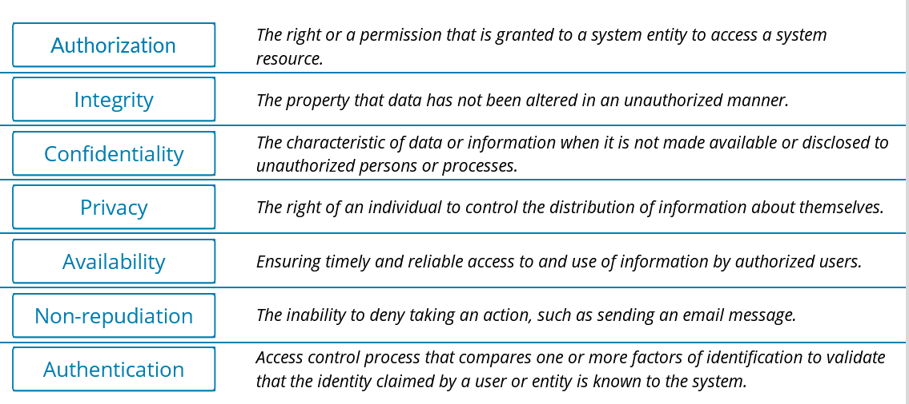
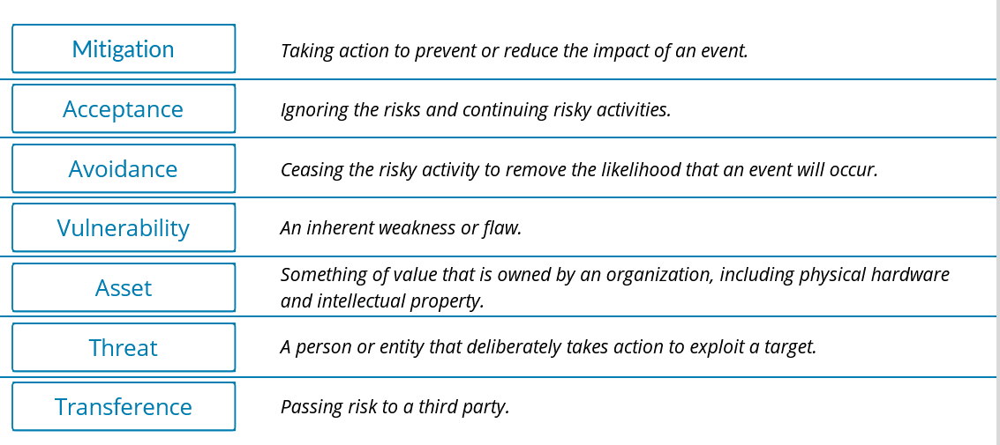
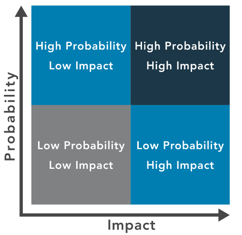
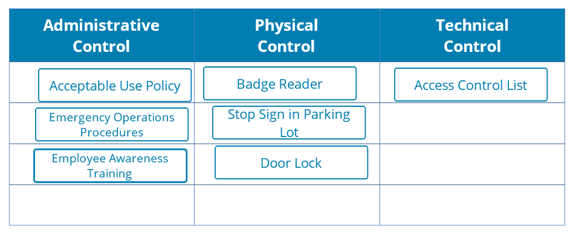
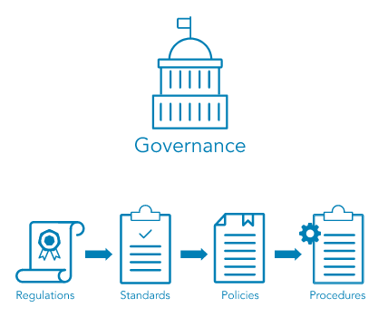

## Chapter 1: Security Principles -

### Module 1: Understand the Security Concepts of Information Assurance
#### Domain D1.1.1, D1.1.2, D1.1.3, D1.1.4, D1.1.5, D1.1.6
#### Module Objective
   - [ ] L1.1.1 Recognize foundational security concepts of information assurance

* **CIA Triad** -
  * Confidentiality -
    * <mark>Protect the data</mark> that needs protection and prevent access to
unauthorized individuals.
  * Integrity -
    * <mark>Ensure the data has not been altered</mark> in an unauthorized manner.
  * Availability -
    * <mark>Ensure data is accessible</mark> to authorized users <mark>when and where it is needed</mark>, and in the form and format that is required.

* Authentication -
	* Process of <mark>verifying or proving the user’s identification</mark> is known as authentication
	* **Three** common methods of authentication:
		* **Something you know** - <mark>Passwords</mark> or passphrases
		* **Something you have** - Tokens, memory cards, <mark>smart cards</mark>
		* **Something you are** - <mark>Biometrics</mark>, measurable characteristics

* Non-repudiation -
	* The protection against an individual falsely denying having performed a particular action.
	* E.g. In today’s world of e-commerce and electronic transactions, there are opportunities for the impersonation of others or denial of an action, such as <mark>_making a purchase online and later denying it._</mark>

* Privacy
	* Privacy is the right of an individual to control the distribution of information about themselves.

* Definitions -
	
---

### Module 2: Understand the Risk Management Process
#### Domain D1.2.1, D1.2.2
#### Module Objectives
   - [ ]  L1.2.1 Define risk management terminology and summarize the process
   - [ ] L1.2.2 Relate risk management to personal or professional practices

* Risk Management -
  * An <mark>**asset** is something in need of protection</mark>.
  * A **vulnerability** is <mark>a *gap or weakness* in those protection efforts</mark>.
  * A **threat** is something or someone that <mark>aims to exploit a vulnerability</mark> to thwart protection efforts.

* Threats -
  *  A **threat** is a person or thing that takes action to exploit (or make use of) a target organization’s system vulnerabilities, as part of achieving or furthering its goal or objectives.
  *  Threat Actors -
     * **Insiders** (either deliberately, by <mark>simple human error</mark>, or by gross incompetence).
     * **Outside individuals** or informal groups (<mark>either planned or opportunistic</mark>, discovering vulnerability).
     * **Formal entities that are nonpolitical** (such as <mark>business competitors</mark> and cybercriminals).
     * **Formal entities that are political** (such as terrorists, nation-states, and <mark>hacktivists</mark>).
     * **Intelligence or information gatherers** (could be any of the above).
     * **Technology** (such as <mark>free-running bots</mark> and artificial intelligence , which could be part of any of the above).
   * Threat Vector - the  <mark>means by which a threat actor carries out their objectives</mark>.

* Vulnerabilities -
  * Vulnerability is <mark>an inherent weakness or flaw</mark> in a system or component, which, <mark>if triggered or acted upon, could cause a risk event</mark> to occur.
  * An organization’s <mark>security team strives to decrease its vulnerability</mark>. To do so, they view their organization with the eyes of the threat actor, asking themselves, “Why would we be an attractive target?” The answers might provide steps to take that will discourage threat actors, cause them to look elsewhere or simply make it more difficult to launch an attack successfully.

* Likelihood -
  * When determining an organization’s vulnerabilities, the security team will consider the probability, or likelihood , of a potential vulnerability being exploited within the construct of the organization’s threat environment.
  * **Impact** is the <mark>magnitude of harm</mark> that can be expected to result from the consequences of unauthorized disclosure of information, unauthorized modification of information, unauthorized destruction of information, or loss of information or information system availability.

* Risk
  * **Identification** -
    * Identify risk to <mark>communicate it clearly</mark>.
    * <mark>Employees at all levels</mark> of the organization are <mark>responsible</mark> for identifying risk.
    * Identify risk <mark>to protect against it</mark>.
	---
  * **Assessment** -
    * process of identifying, estimating and prioritizing risks to an organization’s operations (including its mission, functions, image and reputation), assets, individuals, other organizations and even the nation.
    * A common risk assessment activity identifies the <mark>risk of fire to a building</mark>.
    * The result of the risk assessment process is often documented as <mark>a report or presentation given to management</mark> for their use in prioritizing the identified risk(s).
	---
  * **Treatment** -
    * relates to making decisions about the best actions to take regarding the identified and prioritized risk.
    * The decisions made are dependent on the attitude of management toward risk and the availability and cost of risk mitigation.
	* The commonly used options to respond to risk are -
    	* **Avoidance** - the decision to <mark>attempt to eliminate</mark> the risk entirely.
    	* **Acceptance** - taking <mark>no action to reduce</mark> the likelihood of a risk occurring.
    	* **Mitigation** - taking actions to <mark>prevent or reduce the possibility</mark> of a risk event or its impact.
    	* **Transfer** -  the practice of <mark>passing the risk to another party</mark>, who will accept the financial impact of the harm resulting from a risk being realized in exchange for payment.

* Definitions -
	

* Risk priorities -
  * When risks have been identified, it is time to prioritize and analyze core risks through **qualitative risk** analysis and/or **quantitative risk** analysis. 
  * This is necessary to determine root cause and narrow down apparent risks and core risks.
  * One effective method to prioritize risk is to use a **risk matrix**, which helps <mark>identify priority as the intersection of likelihood of occurrence and impact</mark>.
  
  * Assignment of <mark>priority</mark> may relate to <mark>business priorities, the cost of mitigating a risk or the potential for loss</mark> if an incident occurs.
  * When making decisions based on risk priorities, organizations *must evaluate the likelihood and impact of the risk* as well as their tolerance for different sorts of risk.

* Risk Tolerance -
  * The perception management takes toward risk is often likened to the entity’s **appetite for risk**.
  * **Executive management and/or the Board of Directors** <mark>determines what is an acceptable level of risk</mark> for the organization.
  * Security professionals aim to maintain the levels of risk within management’s limit of risk tolerance.
---

### Module 3: Understand Security Controls
#### Domain D1.3.1, D1.3.2, D1.3.3
#### Module Objectives
   - [ ]  L1.3.1 Classify types of security controls.

* Security controls -
  * pertain to the **physical, technical and administrative mechanisms** that
    * act as <mark>safeguards or countermeasures</mark> prescribed for an information system
    * to <mark>protect the confidentiality, integrity and availability</mark> of the system and its information.
  * The implementation of controls should ***reduce*** risk, hopefully to an acceptable level.
  * **Physical** controls -
    * address **process-based security** needs using <mark>physical hardware devices, such as badge readers, architectural features of buildings and facilities</mark>, and specific security actions to be taken by people.
    * provide protection and control over entry onto the land surrounding the buildings, parking lots or other areas that are within the organization’s control.
  * **Technical (*logical*)** controls -
    * computer systems and networks directly implement.
    * can provide **automated protection from unauthorized access** or misuse, <mark>facilitate detection of security violations and support security requirements</mark> for applications and data.
  * **Administrative (*managerial*)** controls -
    * are <mark>**directives, guidelines or advisories**</mark> aimed at the people within the organization.
    * provide frameworks, constraints and standards for human behavior, and should cover the entire scope of the organization’s activities and its interactions with external parties and stakeholders.
  * Security controls - 
---

### Module 4: Understand Governance Elements and Processes
#### Domain D1.5.1, D1.5.2, D1.5.3, D1.5.4
#### Module Objectives
   - [ ]  L1.4.1 Distinguish between policies, procedures, standards, regulations and laws.
   - [ ]  L1.4.2 Demonstrate the relationship among governance elements.

* Governance elements -
  * When leaders and management implement the systems and structures
    * that the organization will use to achieve its goals,
    * they are guided by **laws and regulations **created by governments to enact public policy.
  * <mark>**Laws and regulations** guide the development of standards, which cultivate policies, which result in procedures.</mark>
  * **Governance elements** - 
    * **Regulations** -
      * Commonly issued in the form of laws, usually from government and typically ***carry financial penalties*** for noncompliance.
      * The Health Insurance Portability and Accountability Act <mark>(**HIPAA**)</mark> of 1996 is an example of a law that <mark>**governs the use of protected health information (PHI)**</mark> in the United States. Violation of the HIPAA rule carries the possibility of fines and/or imprisonment for both individuals and companies.
     ---
     * **Standards** -
       * Organizations use <mark>multiple standards as part of their information systems security programs</mark>, both as compliance documents and as advisories or guidelines.
       * Standards cover a broad range of issues and ideas and may provide assurance that an organization **is operating with policies and procedures that support regulations** and are widely accepted best practices.
       * The International Organization for Standardization (**ISO**) develops and publishes international standards on a variety of technical subjects, including information systems and information security, as well as encryption standards.
       * The National Institute of Standards and Technology <mark>(**NIST**)</mark> is a United States government agency under the Department of Commerce and publishes a variety of technical standards in addition to information technology and information security standards.
       ---
      * **Policies** -
        * Policy is **informed by applicable law(s)** and <mark>specifies which standards and guidelines the organization will follow</mark>. 
        * Governance policies are used to moderate and control decision-making, to ensure compliance when necessary and to guide the creation and implementation of other policies.
        * Policies are implemented, or carried out, by people; for that, someone must expand the policies from statements of intent and direction into step-by-step instructions, or procedures.
         ---
    * **Procedures** -
      * define **the explicit, repeatable activities** <mark>necessary to accomplish a specific task</mark> or set of tasks.
      * They <mark>**provide supporting data, decision criteria** or other explicit knowledge</mark> needed to perform each task.
      * They **establish the measurement criteria and methods** to use to determine whether a task has been successfully completed. 
---

### Module 5: Understand ISC2 Code of Ethics
#### Domain D1.5.1, D1.5.2, D1.5.3, D1.5.4
#### Module Objectives
   - [ ] L1.5.1 Analyze appropriate outcomes according to the canons of the ISC2  Code of Ethics when given examples.

* **Professional Code of Conduct**
  * Preamble -
    * states the purpose and intent of the ISC2 Code of Ethics -
      * The <mark>safety and welfare of society and the common good</mark>, duty to our principals, and to each other, requires that we adhere, and be seen to adhere, to the highest ethical standards of behavior.
      * Therefore, strict adherence to this Code is a condition of certification.
  * **ISC2 Code of ethics canons** -
    * represent the important beliefs held in common by the members of ISC2. Cybersecurity professionals who are members of ISC2 have a duty to the following four entities in the Canons.
      * **Protect** society, the common good, necessary public trust and confidence, and the infrastructure.
      * **Act** honorably, honestly, justly, responsibly and legally.
      * **Provide** diligent and competent service to principals.
      * **Advance** and protect the profession.
---