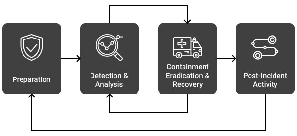

## Chapter 2: Incident Response, Business Continuity and Disaster Recovery Concepts

* Focuses on <mark>availability</mark> part of the CIA triad.

### Module 1: Understand incident response
#### Domain D2.3.1, D2.3.2, D2.3.3
#### Module Objective
   - [ ] L2.1.1 Identify the terms and components of incident response.

* Incident Terminology -
  * Breach -
    * The <mark>loss of control, compromise, unauthorized disclosure, unauthorized acquisition</mark>, or any similar occurrence where: a person other than an authorized user accesses or potentially accesses <mark>personally identifiable information</mark>; or an authorized user accesses personally identifiable information for other than an authorized purpose.
  * Event -
    * Any observable occurrence in a network or system
  * Exploit -
     * These attacks <mark>exploit system vulnerabilities</mark>.
   * Incident -
     * An <mark>event</mark> that actually or potentially <mark>jeopardizes the confidentiality, integrity or availability of an information system</mark> or the information the system processes, stores or transmits.
   * Intrusion -
     * A security event, or combination of events, that constitutes a deliberate security incident in which an <mark>intruder gains, or attempts to gain, access to a system or system resource without authorization</mark>.
   * Threat -
     * Any circumstance or <mark>event with the potential to adversely impact organizational operations</mark> (including mission, functions, image or reputation), organizational assets, individuals, other organizations or the nation through an information system <mark>via unauthorized access, destruction, disclosure, modification of information and/or denial of service</mark>.
   * Vulnerability -
     * <mark>Weakness</mark> in an information system, system security procedures, internal controls or implementation that <mark>could be exploited by a threat source</mark>.
   * Zero Day -
     * A <mark>previously unknown system vulnerability</mark> with the potential of exploitation without risk of detection or prevention because it does not, in general, fit recognized patterns, signatures or methods.

* The Goal of Incident Response -
  * The <mark>priority of any incident response</mark> is to <mark>protect life, health and safety</mark>. The primary goal of incident management is **to be prepared**.
  * Preparation requires having a policy and a response plan that will lead the organization through the crisis (crisis management).
  * The <mark>event having  potential to disrupt the business’s mission</mark>, then it is called an **incident**. Every organization must have an  incident response (IR) plan that will help preserve business viability and survival.
  * The incident response process is <mark>aimed at reducing the impact of an incident</mark> so the organization can resume the interrupted operations as soon as possible.

* Components of the Incident Response Plan -
  * The organization’s vision, strategy and mission should shape the incident response process. <mark>Procedures to implement the IR plan should define the technical processes, techniques, checklists and other tools</mark> that teams will use when responding to an incident.
  * The following components are commonly found in an <mark>incident response plan</mark> -
    * **Preparation** -
      * Develop a policy approved by management.
      * Identify critical data and systems, single points of failure.
      * Train staff on incident response.
      * Implement an incident response team.
      * Practice Incident Identification. (First Response)
      * Identify Roles and Responsibilities.
      * Plan the coordination of communication between stakeholders.
    * **Detection and Analysis** -
      * Monitor all possible attack vectors.
      * Analyze incident using known data and threat intelligence.
      * Prioritize incident response.
      * Standardize incident documentation.
    * **Containment** -
      * Gather evidence.
      * Choose an appropriate containment strategy.
      * Identify the attacker.
      * Isolate the attack.
    * **Post-Incident Activity** -
      * Identify evidence that may need to be retained.
      * Document lessons learned.
      * Retrospective -
        * Preparation
        * Detection and Analysis
        * Containment, Eradication and Recovery
        * Post-incident Activity

   * NIST Computer Security Incident Handling Lifecycle - 

   * Incident Responce Team -
     * A typical incident response team is a **cross-functional group of individuals** who represent the management, technical and functional areas of responsibility most directly impacted by a security incident.
     * Potential team members include the following -
       * Representative(s) of senior management
       * Information security professionals
       * Legal representatives
       * Public affairs/communications representatives
       * Engineering representatives (system and network)
     * Team members should have training on **incident response** and the **organization’s incident response plan**. Typically, team members assist with *investigating* the incident, *assessing* the damage, collecting evidence, reporting the incident and initiating recovery procedures. They would also participate in the remediation and lessons learned stages and help with root cause analysis.
     * When an incident occurs, the response team (CIRT/CSIRT) has four primary responsibilities -
       1. Determine the amount and scope of damage caused by the incident.
       2. Determine whether any confidential information was compromised during the incident.
       3. Implement any necessary recovery procedures to restore security and recover from incident-related damage.
       4. Supervise the implementation of any additional security measures necessary to improve security and prevent recurrence of the incident.
---

### Module 2: Understand business continuity
#### Domain D2.1.1, D2.1.2, D2.1.3
#### Module Objective
   - [ ] L2.2.1 Summarize the components of a business continuity plan.

* The Importance of Business Continuity -
  * The intent of a business continuity plan (BCP) is to sustain business operations while recovering from a significant disruption.
  * Organizations will go through their procedures and checklists to make sure they know exactly who is responsible for which action during a BC activity.
* Components of a Business Continuity Plan -
  * **Business continuity planning (BCP)** is the proactive development of procedures to restore business operations after a disaster or other significant disruption to the organization.
  * Members from across the organization should participate in creating the BCP to ensure all systems, processes and operations are accounted for in the plan.
  * Here are some common components of a comprehensive business continuity plan -
    1. List of the BCP team members, including multiple contact methods and backup members.
    2. Immediate response procedures and checklists -
       1. security and safety procedures
       2. fire suppression procedures,
       3. notification of appropriate emergency-response agencies, etc.
    3. Notification systems and call trees for alerting personnel that the BCP is being enacted
    4. Guidance for management, including designation of authority for specific managers
    5. How/when to enact the plan
    6. Contact numbers for critical members of the supply chain -
       1. Vendors,
       2. Customers,
       3. Possible external emergency providers,
       4. 3rd-party partners, etc.
---

### Module 3: Understand disaster recovery
#### Domain D2.2, D2.2.1, D2.2.2, D2.2.3
#### Module Objective
   - [ ] L2.3.1 Identify the components of disaster recovery.

* The Goal of Disaster Recovery (DR) -
  * Disaster recovery planning steps in where BC leaves off. When a disaster strikes or an interruption of business activities occurs, the Disaster recovery plan (**DRP**) guides the actions of emergency response personnel until the end goal is reached—which is to see the business restored to full last-known reliable operations.
  * Disaster recovery refers specifically to restoring the information technology and communications services and systems needed by an organization, both during the period of disruption caused by any event and during restoration of normal services.
  * Business continuity planning is about maintaining critical business functions during a disaster/disruption, disaster recovery planning is about restoring IT and communications back to full operations after a disruption.

* Components of a Disaster Recovery Plan -
  * Executive summary providing a high-level overview of the plan
  * Department-specific plans
  * Technical guides for IT personnel responsible for implementing and maintaining critical backup systems
  * Full copies of the plan for critical disaster recovery team members
  * Checklists for certain individuals -
    * Critical disaster recovery team members will have checklists to help guide their actions amid the chaotic atmosphere of a disaster.
    * IT personnel will have technical guides helping them get the alternate sites up and running.
    * Managers and public relations personnel will have simple-to-follow, high-level documents to help them communicate the issue accurately without requiring input from team members who are busy working on the recovery.
---