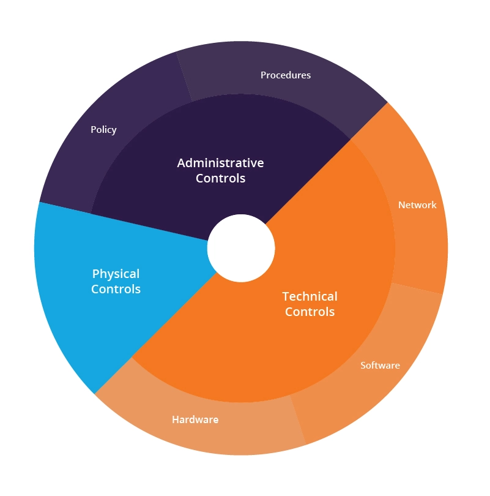

## Chapter 3: Access Control Concepts

* A control is a safeguard or countermeasure designed to preserve Confidentiality, Integrity and Availability of data.

### Module 1: Understand Access  Control  Concepts
#### Domain D3.1, D3.1.3, D3.1.5, D3.2, D3.2.1, D3.2.2, D3.2.5
#### Module Objective
   - [ ] L3.1.1 Relate access control concepts and processes given scenarios.

* Overview -
  * Access controls are not just about restricting access to information systems and data, but also about allowing access. It is about granting the appropriate level of access to authorized personnel and processes and denying access to unauthorized functions or individuals.
  * Access is based on **three** terms -
    1. Subjects -
       * Any entity that requests access to the assets.
       * A **subject** -
         * Is a user, a process, a procedure, a client (or a server), a program, a device such as an endpoint, workstation, smartphone or removable storage device with onboard firmware.
         * Is active: It initiates a request for access to resources or services.
         * Requests a service from an object.
         * Should have a level of clearance (permissions) that relates to its ability to successfully access services or resources.
     ---
    2. Objects -
       * Anything that a subject attempts to access is referred to as an object.
       * Objects are passive, not active (in access control terms), and must be protected from unauthorized access.
       * An object has an owner, and the owner has the right to determine who or what should be allowed access to their object.
       * An **object** -
         * Is a building, a computer, a file, a database, a printer or scanner, a server, a communications resource, a block of memory, an input/output port, a person, a software task, thread or process.
         * Is anything that provides service to a user.
         * Is passive.
         * Responds to a request.
         * May have a classification.
     ---
     3. Rules -
        * An access rule is an instruction developed to allow or deny access to an object by comparing the validated identity of the subject to an access control list.
        * A **rule** can -
          * Compare multiple attributes to determine appropriate access.
          * Allow access to an object.
          * Define how much access is allowed.
          * Deny access to an object.
          * Apply time-based access.

* Defense in Depth -
  * describes an information security strategy that integrates people, technology and operations capabilities to establish variable barriers across multiple layers and missions of the organization.
  * It applies multiple countermeasures in a layered fashion to fulfill security objectives.
  * Defense-in-depth - 
  * For example, consider the **multiple layers of access** required to get to the actual data in a data center.
    * First, a lock on the door provides a physical barrier to access the data storage devices.
    * Second, a technical access rule prevents access to the data via the network.
    * Finally, a policy, or administrative control defines the rules that assign access to authorized individuals.

* Principle of Least Privilege -
  * a standard of **permitting only minimum access necessary** for users or programs to fulfill their function.
  * To preserve the confidentiality of information and ensure that it is only available to personnel who are authorized to see it, we use privileged access management, which is based on the principle of least privilege. That means each user is granted access only to the items they need and nothing further.

* Privileged Accounts -
  * Privileged accounts are those with permissions beyond those of normal users, such as managers and administrators.
    * *Systems administrators*, who have the principal responsibilities for operating systems, applications deployment and performance management.
    * *Help desk or IT support staff*, who often need to view or manipulate endpoints, servers and applications platforms by using privileged or restricted operations.
    * *Security analysts*, who may require rapid access to the entire IT infrastructure, systems, endpoints and data environment of the organization.
  * Measures used for moderating the potential for elevated risks from misuse or abuse of privileged accounts include the following -
    * More extensive and detailed logging than regular user accounts. 
    * More stringent access control than regular user accounts. (Just-in-time identity should also be considered as a way to restrict the use of these privileges to specific tasks and the times in which the user is executing them.)
    * Deeper trust verification than regular user accounts. (Privileged account holders should be subject to more detailed background checks, stricter nondisclosure agreements and acceptable use policies, and be willing to be subject to financial investigation.)
    * More auditing than regular user accounts. (Privileged account activity should be monitored and audited at a greater rate and extent than regular usage.)

* Segregation of Duties -
  * is based on the security practice that no one person should control an **entire high-risk** transaction from start to finish.
  * Segregation of duties breaks the transaction into separate parts and requires a different person to execute each part of the transaction.
  * **Collusion** is a possibility,  that two individuals can willfully work together to bypass the segregation of duties, so that they could jointly commit fraud.

* Authorized Versus Unauthorized Personnel -
  * Subjects are authorized access to objects after they have been authenticated. Once a subject has been authenticated, the system checks its authorization to see if it is allowed to complete the action it is attempting. It is usually achieved using **security matrix** accessed by the access control system, based on pre-approved levels.
---

### Module 2: Understand  Physical  Access
#### Domain D3.1, D3.1.1, D3.1.2
#### Module Objective
   - [ ] L3.2.1 Compare various physical access controls.

* Physical Security Controls -
  * Physical access controls are items you can **physically touch**. They include physical mechanisms deployed <mark>*to prevent, monitor, or detect direct contact*</mark> with systems or areas within a facility.
  * Examples of physical access controls include security guards, fences, motion detectors, locked doors/gates, sealed windows, lights, cable protection, laptop locks, badges, swipe cards, guard dogs, cameras, mantraps/turnstiles, and alarms.
  * Why have physical security controls?
    * Physical access controls include fences, barriers, turnstiles, locks and other features that prevent unauthorized individuals from entering a physical site, such as a workplace. This is to protect not only physical assets such as computers from being stolen, but also to protect the health and safety of the personnel inside.

* Types of Physical Access Controls -
  1. Badge Systems and Gate Entry -
     * Physical security controls for human traffic are often done with technologies such as turnstiles, mantraps and remotely or system-controlled door locks.
     * An access control system compares an individual’s badge against a verified database. If authenticated, the access control system sends output signals allowing authorized personnel to pass through a gate or a door to a controlled area.
  2. Environmental Design -
     * Crime Prevention through Environmental Design (CPTED) approaches the challenge of creating safer workspaces through passive design elements.
     * CPTED provides direction to solve the challenges of crime with organizational (people), mechanical (technology and hardware) and natural design (architectural and circulation flow) methods.
  3. Biometrics -
     * To authenticate a user’s identity, biometrics uses characteristics unique to the individual seeking access. A biometric authentication solution entails two processes -
        1. Enrollment—during the enrollment process, the user’s registered biometric code is either stored in a system or on a smart card that is kept by the user.
        2. Verification—during the verification process, the user presents their biometric data to the system so that the biometric data can be compared with the stored biometric code.
     * Biometrics takes two primary forms, **physiological** and **behavioral** -
       * Physiological systems measure the characteristics of a person such as a fingerprint, iris scan (the colored portion around the outside of the pupil in the eye), retinal scan (the pattern of blood vessels in the back of the eye), palm scan and venous scans that look for the flow of blood through the veins in the palm
       * Behavioral systems measure how a person acts by measuring voiceprints, signature dynamics and keystroke dynamics. As a person types, a keystroke dynamics system measures behavior such as the delay rate (how long a person holds down a key) and transfer rate (how rapidly a person moves between keys).
       * Biometric systems are considered highly accurate, but they can be expensive to implement and maintain because of the cost of purchasing equipment and registering all users. Users may also be uncomfortable with the use of biometrics, considering them to be an invasion of privacy or presenting a risk of disclosure of medical information (since retina scans can disclose medical conditions). A further drawback is the challenge of sanitization of the devices.

* Monitoring -
  * The use of physical access controls and monitoring personnel and equipment entering and leaving as well as auditing/logging all physical events are primary elements in maintaining overall organizational security.
    * **Cameras** are normally integrated into the overall security program and centrally monitored.
    * **Alarm systems** are commonly found on doors and windows in homes and office buildings.
    * **Security guards** helpm prevent theft and abuse of equipment or information and prevent masqueraders.
    * **Log** A log is a record of events that have occurred. Logs should be captured and retained as long as necessary for legal or business reasons.
---

### Module 3: Understand  Logical  Access 
#### Domain D3.2, D3.2.3, D3.2.4, D3.2.5
#### Module Objective
   - [ ] L3.3.1 Describe logical access controls.

* Logical controls -
  * electronic methods that limit someone from getting access to systems, and sometimes even to tangible assets or areas.
  * Types of logical access controls include:
    * Passwords
    * Biometrics (implemented on a system, such as a smartphone or laptop)
    * Badge/token readers connected to a system
  * Logical access controls sometimes limit who can get logical access to an asset, even if the person already has physical access.

* Discretionary Access Control (DAC) -
  * is a specific type of **access control policy** that is enforced over all subjects and objects in an information system.
  * In DAC, the policy specifies that a subject who has been granted access to information can do one or more of the following -
    * Pass the information to other subjects or objects
    * Grant its privileges to other subjects
    * Change security attributes on subjects, objects, information systems or system components
    * Choose the security attributes to be associated with newly created or revised objects; and/or
    * Change the rules governing access control; mandatory access controls restrict this capability
  * In a DAC system, a user who has access to a file is usually able to share that file with or pass it to someone else. This grants the user almost the same level of access as the original owner of the file.
  * DACs are not very scalable; they rely on the access control decisions made by each individual object owner, and it can be difficult to find the source of access control issues when problems occur.

* Mandatory Access Control (MAC) -
  * policy is uniformly enforced across all subjects and objects within the boundary of an information system.
  * This means that only **properly designated security administrators**, as trusted subjects, can modify any of the security rules that are established for subjects and objects within the system.
  * This also means that for all subjects defined by the organization (that is, known to its integrated identity management and access control system), the organization assigns a subset of total privileges for a subset of objects, such that the subject is constrained from doing any of the following -
    * Passing the information to unauthorized subjects or objects
    * Granting its privileges to other subjects
    * Changing one or more security attributes on subjects, objects, the information system or system components
    * Choosing the security attributes to be associated with newly created or modified objects
    * Changing the rules governing access control
  * How MAC is different to DAC?
    * The primary difference is who can control access.
    * With MAC, it is mandatory for security administrators to assign access rights or permissions;
    * with DAC, it is up to the object owner’s discretion.

  * Role-Based Access Control (RBAC) -
    * RBAC sets up user permissions based on roles. Each role represents users with similar or identical permissions.
---