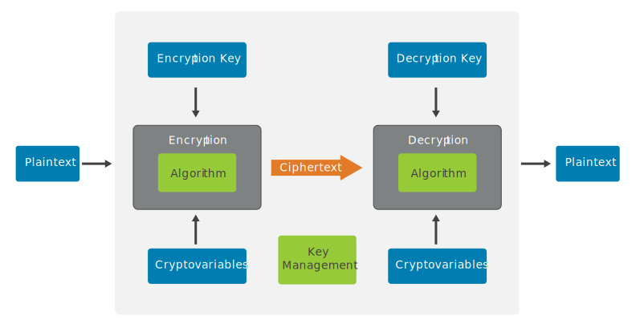
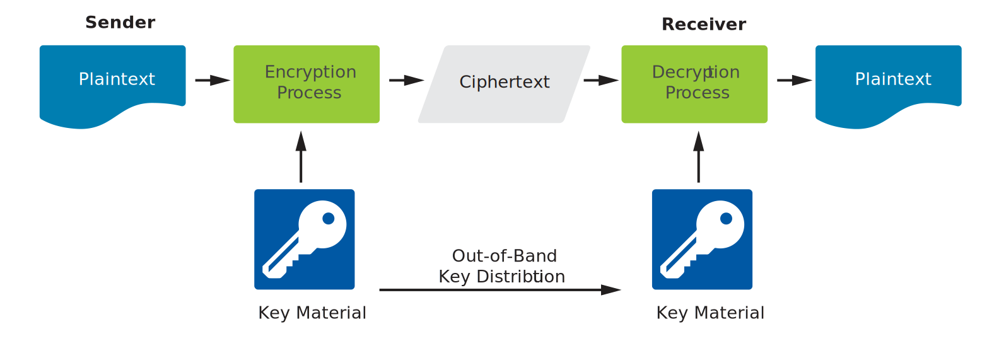
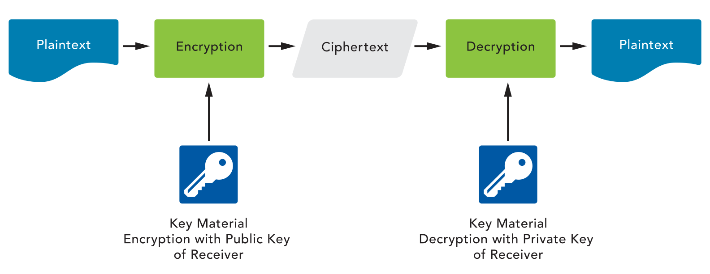

## Chapter 5: Security Operations

* A control is a safeguard or countermeasure designed to preserve Confidentiality, Integrity and Availability of data.

### Module 1: Understand  Data Security
#### Domain D5.0, D5.1.1, D5.1.2, D5.1.3
#### Module Objective
   - [ ] L5.0 Explain concepts of security operations.
   - [ ] L5.1.1 Discuss data handling best practices.
   - [ ] L5.1.2 Identify key concepts of logging and monitoring.
   - [ ] L5.1.3 Summarize the different types of encryption and their common uses

* **Hardening** is the process of
  * ==applying secure configurations== (to reduce the attack surface) and
  * ==locking down various hardware, communications systems and software==, including the operating system, web server, application server and applications.

* Data Handling -
  * Data itself goes through its own life cycle as users create, use, share and modify it.
  * Data security life cycle model -
    * is useful because it can align easily with the different roles that people and organizations perform during the evolution of data from creation to destruction (or disposal).
    * It also helps put the different data states of in use, at rest and in motion, into context.
    * All ideas, data, information or knowledge can be thought of as going through ==six major sets of activities throughout its lifetime==.
      1. **Create** - Creating the knowledge, which is usually tacit knowledge at this point.
      2. **Store** - Storing or recording it in some fashion (which makes it explicit).
      3. **Use** - Using the knowledge, which may cause the information to be modified, supplemented or partially deleted.
      4. **Share** - Sharing the data with other users, whether as a copy or by moving the data from one location to another.
      5. **Archive** - Archiving the data when it is temporarily not needed.
      6. **Destroy** - Destroying the data when it is no longer needed.

* Data Handling Practices -
  1. Classification -
     * Classification is the process of ==recognizing the organizational impacts if the information suffers any security compromises related to its characteristics== of confidentiality, integrity and availability.
     * Classifications are ==derived from laws, regulations, contract-specified standards or other business expectations==.
     * Businesses recognize that information has value and others might steal their advantage if the information is not kept confidential, so they classify it. These classifications dictate rules and restrictions about how that information can be used, stored or shared with others.
     * Classification of data, which asks the question ==“Is it secret?” determines the labeling==, handling and use of all data.
     * The immediate ==benefit of classification== is that it can ==lead to more efficient design and implementation of security processes==, if we can treat the protection needs for all similarly classified information with the same controls strategy.
   2. Labeling -
      * Security labels are part of implementing controls to ==protect classified information==.
      * It is reasonable to want a simple way of assigning a level of sensitivity to a data asset, such that the higher the level, the greater the presumed harm to the organization, and thus the greater security protection the data asset requires.
      * Data sensitivity levels and labels - Unless otherwise mandated, organizations are free to create classification systems that best meet their own needs.
        * **Highly restricted** - Compromise of data with this sensitivity label could possibly put the organization’s future existence at risk. Compromise could lead to substantial loss of life, injury or property damage, and the litigation and claims that would follow.
        * **Moderately restricted** - Compromise of data with this sensitivity label could lead to loss of temporary competitive advantage, loss of revenue or disruption of planned investments or activities.
        * **Low sensitivity (sometimes called “internal use only”)** - Compromise of data with this sensitivity label could cause minor disruptions, delays or impacts.
        * **Unrestricted public data** - As this data is already published, no harm can come from further dissemination or disclosure.
   3. Retention -
      * Information and data should be ==kept only for as long as it is beneficial==, no more and no less.
      * For various types of data, certain industry standards, laws and regulations define retention periods. When such external requirements are ==**not set**, it is an organization’s responsibility to define and implement its own data retention policy==.
      * Data retention policies are ==applicable both for hard copies and for electronic data==, and no data should be kept beyond its required or useful life.
      * Organizations should ==conduct a periodic review of retained records in order to reduce the volume of information== stored and to ensure that only necessary information is preserved.
      * Records retention policies ==indicate how long== an organization is required to maintain information and assets. Policies should guarantee that:
        * Personnel understand the various retention requirements for data of different types throughout the organization.
        * The organization appropriately documents the retention requirements for each type of information.
        * The systems, processes and individuals of the organization retain information in accordance with the required schedule but no longer.
      * A ==common mistake== in records retention is ==applying the longest retention period to all types of information== in an organization. This not only wastes storage but also increases risk of data exposure and adds unnecessary “noise” when searching or processing information in search of relevant records. It may also be ==in violation of externally mandated requirements== such as legislation, regulations or contracts (which may result in fines or other judgments).
      * ==Records and information no longer mandated to be retained should be destroyed in accordance with the policies== of the enterprise and any appropriate legal requirements that may need to be considered.
   4. Destruction -
      * Data that ==might be left on media after deleting is known as **remanence**== and may be a significant security concern. Steps must be taken to reduce the risk that data remanence could compromise sensitive information to an acceptable level.
        * **Zeroizing** is a process of clearing the device or system, which usually involves writing multiple patterns of random values throughout all storage media (such as main memory, registers and fixed disks).
        * **Purging** the device or system, which eliminates (or greatly reduces) the chance that residual physical effects from the writing of the original data values may still be recovered, even after the system is cleared.
        * **Physical destruction** of the device or system is the ultimate remedy to data remanence.

* Logging and Monitoring Security Events
  * Logging is the primary form of instrumentation that ==attempts to capture signals generated by events==. Events are any actions that take place within the systems environment and cause measurable or observable change in one or more elements or resources within the system.
  * Logging and monitoring the health of the information environment is essential to ==identifying inefficient or improperly performing systems, detecting compromises and providing a record== of how systems are used.
  * Robust logging practices provide tools to ==effectively correlate information from diverse systems== to fully understand the relationship between one activity and another.
  * ==Log reviews== are an essential function not only for security assessment and testing but also for ==identifying security incidents, policy violations, fraudulent activities and operational problems== near the time of occurrence.
  * It is helpful for an organization to ==create components of a log management infrastructure== and determine how these components interact. This aids in preserving the integrity of log data from accidental or intentional modification or deletion and in maintaining the confidentiality of log data.
  * Organizations must maintain adherence to retention policy for logs as prescribed by law, regulations and corporate governance. Since attackers want to hide the evidence of their attack, the organization’s policies and procedures should also ==address the preservation of original logs==.

* Event Logging Best Practices
  * **Ingress monitoring** refers to ==surveillance and assessment of all inbound communications traffic and access attempts==. Devices and tools that offer logging and alerting opportunities for ingress monitoring include -
    * Firewalls
    * Gateways
    * Remote authentication servers
    * IDS/IPS tools
    * SIEM solutions
    * Anti-malware solutions
  * **Egress monitoring** is used to ==regulate data leaving the organization’s IT environment==. The term currently used in conjunction with this effort is data loss prevention (DLP) or data leak protection.
    * The DLP solution should be deployed so that it can inspect all forms of data leaving the organization, including:
      * Email (content and attachments)
      * Copy to portable media
      * File Transfer Protocol (FTP)
      * Posting to web pages/websites
      * Applications/application programming interfaces (APIs)

* Encryption
  * Encryption protects our personal and business transactions; digitally signed software updates verify their creator’s or supplier’s claim to authenticity.
  * Cryptography is used to ==protect information by keeping its meaning or content secret and making it unintelligible== to someone who does not have a way to decrypt (unlock) that protected information.
  * The objective of every encryption system is ==to transform an original set of data, called the plaintext, into an otherwise unintelligible encrypted form, called the ciphertext==.
  * An encryption system is ==the set of hardware, software, algorithms, control parameters and operational methods== that provide a set of encryption services.
  
  * Properly used, ==singly or in combination, cryptographic solutions provide a range of services== that can help achieve required systems security postures in many ways:
    * **Confidentiality** - Cryptography provides confidentiality by hiding or obscuring a message so that it cannot be understood by anyone except the intended recipient.
    * **Integrity** - hash functions and digital signatures can provide integrity services that allow a recipient to verify that a message has not been altered by malice or error.
  * **Symmetric Encryption** -
    * uses the ==**same key** in both the encryption and the decryption processe==s. It could be said that the decryption process is just a mirror image of the encryption process.
    
    * The same key is used for both the encryption and decryption processes. ==This means that the two parties communicating need to share knowledge of the same key.== This type of algorithm protects data, as a person who does not have the correct key would not be able to read the encrypted message. Because the key is shared, however, this can lead to several other challenges:
      * If two parties suspect a specific communication path between them is compromised, they obviously can't share key material along that path. Someone who has compromised communications between the parties would also intercept the key.
      * Distribution of the key is difficult, because the key cannot be sent in the same channel as the encrypted message, or the man-in-the-middle (MITM) would have access to the key. Sending the key through a different channel (band) than the encrypted message is called out-of-band key distribution. Examples of out-of-band key distribution would include sending the key via courier, fax or phone.
      * Any party with knowledge of the key can access (and therefore change) the message.
      * Each individual or group of people wishing to communicate would need to use a different key for each individual or group they want to connect with. This raises the ==challenge of scalability== — the number of keys needed grows quickly as the number of different users or groups increases.
      * Primary uses of symmetric algorithms -
        * Encrypting bulk data (backups, hard drives, portable media)
        * Encrypting messages traversing communications channels (IPsec, TLS)
        * Streaming large-scale, time-sensitive data (audio/video materials, gaming, etc.)
  * **Asymmetric Encryption** -
    * uses ==one key to encrypt== and a ==different key to decrypt== the input plaintext.
    * A user wishing to communicate using an asymmetric algorithm would first generate a key pair.
    * To ensure the ==strength of the key generation process==, this is usually done by the cryptographic application or ==the public key infrastructure (PKI)== implementation without user involvement.
    * One half of the key pair is ==kept secret==; only the key holder knows that key. This is why it is called ==the private key==. The other half of the key pair can be ==given freely to anyone== who wants a copy.  Therefore, this second half of the key pair is referred to as the ==public key==.
    * Asymmetric key cryptography ==solves the problem of key distribution== by allowing a message to be sent across an untrusted medium in a secure manner without the overhead of prior key exchange or key material distribution. It ==allows the non-repudiation of origin and delivery, access control and data integrity== as well as ==solves the problem of scalability==.
    
    * The ==problem==, however, has been that asymmetric cryptography is ==extremely slow== compared with its symmetric counterpart.
  * **Hashing** -
    * takes an ==input set of data (of almost arbitrary size)== and ==returns a fixed-length result== called the hash value. A hash function is the algorithm used to perform this transformation. It helps in ==ensuring message integrity==.
    * To be useful and secure, a cryptographic hash function must demonstrate five main properties -
      1. **Useful** - It is easy to compute the hash value for any given message.
      2. **Nonreversible** - It is computationally infeasible to reverse the hash process or otherwise derive the original plaintext of a message from its hash value.
      3. **Content integrity assurance** - It is computationally infeasible to modify a message such that re-applying the hash function will produce the original hash value.
      4. **Unique** - It is computationally infeasible to find two or more different, sensible messages that hash to the same value.
      5. **Deterministic** - The same input will always generate the same hash, when using the same hashing algorithm.
     * hash functions have many applications in information security, including ==digital signatures, message authentication codes== and other forms of authentication. They can also be ==used for fingerprinting, to detect duplicate data or uniquely identify files, and as checksums to detect accidental data corruption==.
      * ==variable data input + hashing algorithm = fixed bit size data output (the digest)==
    
    * hash digest can be used to confirm that ==the input exactly matches what is expected or required==, for instance, a password.
     * The problem with a simple hash functions is that ==it does not protect== against a malicious attacker that would be able to change ==both the message and the hash/digest== by intercepting it in transit.
---

### Module 2: Understand  System Hardening
#### Domain D5.2.1
#### Module Objective
   - [ ] L5.2.1 Describe the concepts of configuration management.

* Configuration Management -
  * is a process and discipline used to ensure that ==the only changes made to a system are those that have been authorized and validated==.
    * **Identification** - Baseline identification of a system and all its components, interfaces and documentation.
    * **Baseline** - A security baseline is a ==minimum level of protection== that can be used as a reference point.
    * **Change Control** - An update process for requesting changes to a baseline, by means of making changes to one or more components in that baseline. A review and approval process for all changes. This ==includes updates and patches==.
    * **Verification & Audit** - A regression and validation process, which may involve testing and analysis, to verify that ==nothing in the system was broken by a newly applied set of changes==.
  * Effective use of configuration management gives systems owners, operators, support teams and security professionals another important set of tools they can use to monitor and oversee the configuration of the devices, networks, applications and projects of the organization.
  * An organization may ==mandate the configuration of equipment== through standards and baselines. The use of standards and baselines can ==ensure that network devices, software, hardware and endpoint devices are configured in a consistent way== and that all such devices are compliant with the security baseline established for the organization.
    * **Inventory** - Making an inventory, catalog or registry of all the information assets that the organization is aware of (whether they already exist, or there’s a wish list or need to create or acquire them) is the first step in any ==asset management process==.
    * **Baselines** - a total inventory of all the system’s components, hardware, software, data, administrative controls, instructions. When protecting assets, baselines can be particularly helpful in achieving a minimal protection level of those assets based on value.
    * **Updates** - Repairs, maintenance actions and updates are frequently required on almost all levels of systems elements, from the basic infrastructure of the IT architecture on up through operating systems, applications platforms, networks and user interfaces. They must also be ==regression tested to verify that the modifications did not introduce other erroneous or unexpected behaviors== in the system.
    * **Patches** -  A patch is an update, upgrade or modification to a system or component. These patches may be needed to ==address a vulnerability== or to improve functionality. An organization should test the patch before rolling it out across the organization.
---

### Module 3: Understand  Best Practice Security Policies
#### Domain D5.3, D5.3.1, D5.3.2, D5.3.3, D5.3.4, D5.3.5, D5.3.6
#### Module Objective
   - [ ] L5.3.1 Explain the application of common security policies.

* Common Security Policies -
  * Policies will be set according to the needs of the organization and its vision and mission. Each of these policies should have a penalty or a consequence attached in case of noncompliance.
    * Data Handling Policy -
      * defines whether data is for use within the company, is restricted for use by only certain roles or can be made public to anyone outside the organization.
    * Password Policy -
      * defines expectations of systems and users in order to ensuring secure access to data by outlining any standards that the organization has selected for password formulation.
    * Acceptable Usage Policy (AUP) -
      * defines acceptable use of the organization’s network and computer systems and can help protect the organization from legal action.
      * Policy aspects commonly included in AUPs: Data access, System access, Data disclosure, Passwords, Data retention, Internet usage, Company device usage.
    * Bring Your Own Device (BYOD) Policy -
      * Letting employees choose the device that is most comfortable for them may be good for employee morale, but it presents additional challenges for the security professional because it means the organization loses some control over standardization and privacy.
      * All employees must read and agree to adhere to BYOD policy before any access to the systems, network and/or data is allowed.
    * Privacy Policy -
      * should stipulate which information is considered ==PII (personally identifiable information)/ePHI (electronic protected health information)==, the appropriate handling procedures and mechanisms used by the organization.
      * The organization should also create a public document that explains how private information is used, both internally and externally.
    * Change Management Policy -
      * Change management is the discipline of ==transitioning from the current state to a future state==. It consists of three major activities:
        * deciding to change,
        * making the change, and
        * confirming that the change has been correctly accomplished.
      * Change management policy focuses on making the decision to change and results in the approvals to systems support teams, developers and end users to start making the directed alterations.
      * Change management requires a process to implement the necessary changes so they do not adversely affect business operations.

* Change Management - Process Components
  * **Request for Change (RFC)**/ Documentation -
    * All of the major change management practices address a common set of core activities that start with a request for change (RFC) and move through various development and test stages until the change is released to the end users.
  * **Approval** -
    * Includes:
      * Evaluating the RFCs for completeness,
      * Assignment to the proper change authorization process based on risk and organizational practices,
      * Stakeholder reviews,
      * resource identification and allocation,
      * Appropriate approvals or rejections, and
      * Documentation of approval or rejection.
  * **Rollback** -
    * Depending upon the nature of the change, a variety of activities may need to be completed. These generally include -
      * Scheduling the change,
      * Testing the change,
      * Verifying the rollback procedures,
      * Implementing the change,
      * Evaluating the change for proper and effective operation, and
      * Documenting the change in the production environment.
    * Rollback authority would generally be defined in the rollback plan, which might be immediate or scheduled as a subsequent change if monitoring of the change suggests inadequate performance.
---

### Module 4: Understand Security Awareness Training
#### Domain D5.4, D5.4.1, D5.4.2, D5.3.2
#### Module Objective
   - [ ] L5.4.1 Discuss the importance of security awareness training.

* Purpose
  * to make sure everyone knows what is expected of them, based on responsibilities and accountabilities, and to find out if there is any carelessness or complacency that may pose a risk to the organization.

* What is Security Awareness Training?
  * **Education** - The overall goal of education is to help learners improve their understanding of these ideas and their ability to relate them to their own experiences and apply that learning in useful ways.
  * **Training** - Focuses on building proficiency in a specific set of skills or actions, including sharpening the perception and judgment needed to make decisions as to which skill to use, when to use it and how to apply it.
  * **Awareness** - hese are activities that attract and engage the learner’s attention by acquainting them with aspects of an issue, concern, problem or need.
---